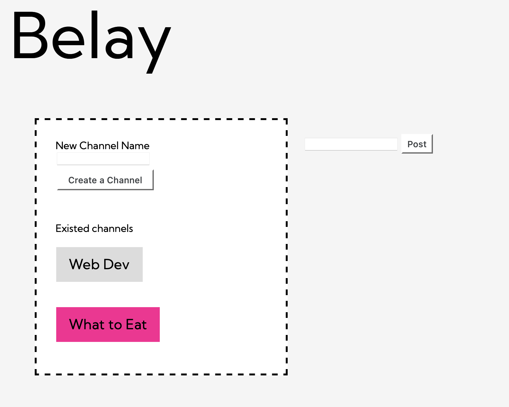

# Belay: User Handbook

### Start Belay

1. Navigate to the "workplace_messaging_application" directory.
2. run ```sqlite3 ./db/belay.db < ./db/20220311T015900_create_tables.sql``` to initialize database.
3. Make sure flask and bcrypt are installed. If not, run ```pip3 install flask``` and ```pip3 install bcrypt``` to install them.
4. Run ```flask run``` to start belay.

### New User Log in


- If you are new to Belay, you will be redirected to /auth page to log in or create a new account.
- If you are to create a new account, note that username must be unique, the page will alert you if you try to create an
  account with existed username.
- Once you successfully logged in or created a new account, you will see all the existed channles.

### Channels


- You will see the above page when there is no channal yet after you logged in.
- Create a new channal by providing a new channal name and hitting the "Create a Channal" button. Note that channal name
  must be unique, you will be alert to resubmit the channal name if you try to create a channal with existed channel
  name.



- Belay has two column layout, where the left column displays channels and the right column display messages of the
  channel you are in.
- Channels will appear on the page once they are created, no matter who created them.
- Once you create a channel, you will automatically locate in that channel.
- You can nagivate through channels by clicking the channel bar with channel name on it. The channel you are currently
  in is pink highlighted.
- You can post message to the channel you are in by typing message content and then hitting the "Post" button.


- Belay displays your unread message count beside the channel bar.
- Each message shows the author and the number of replies, if any.
- You can reply a message by clicking the "reply" button inside the messagse.


- If a message contains valid image urls, the images will be displayed at the bottom right corner of the message.

- 

- After hitting "reply" button, you will be redirected to a reply page, where the original message is displayed above
  the reply box, and the existed replies displayed below the reply box in reverse chronological order. That is, with the
  newest replies at the top.
- You can go back to the channel page by hitting the back button of your browser.